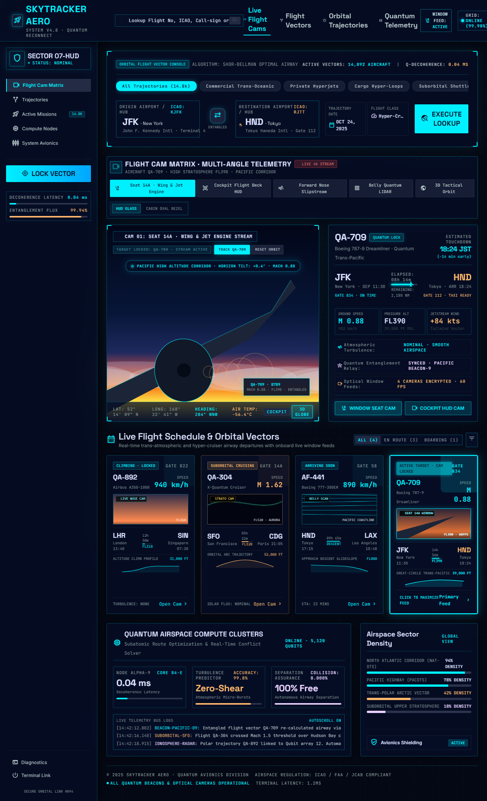

# SkyTracker Aero

Futuristic flight-tracking dashboard with a glassmorphic cockpit-HUD interface.

🔗 **[Live Demo](https://diwakaranmol888-sketch.github.io/skytracker-aero/)**

## Features
- Multi-angle flight cam matrix
- Live flight schedule and orbital vectors
- Airspace density and telemetry logs
- Dark, high-density avionics design system (see `DESIGN.html.md`)
- 
